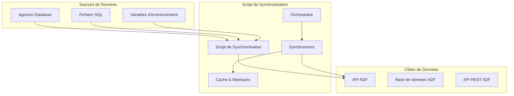
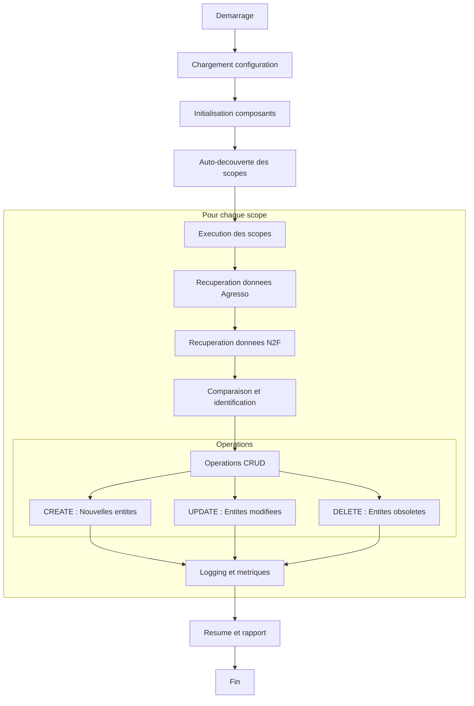
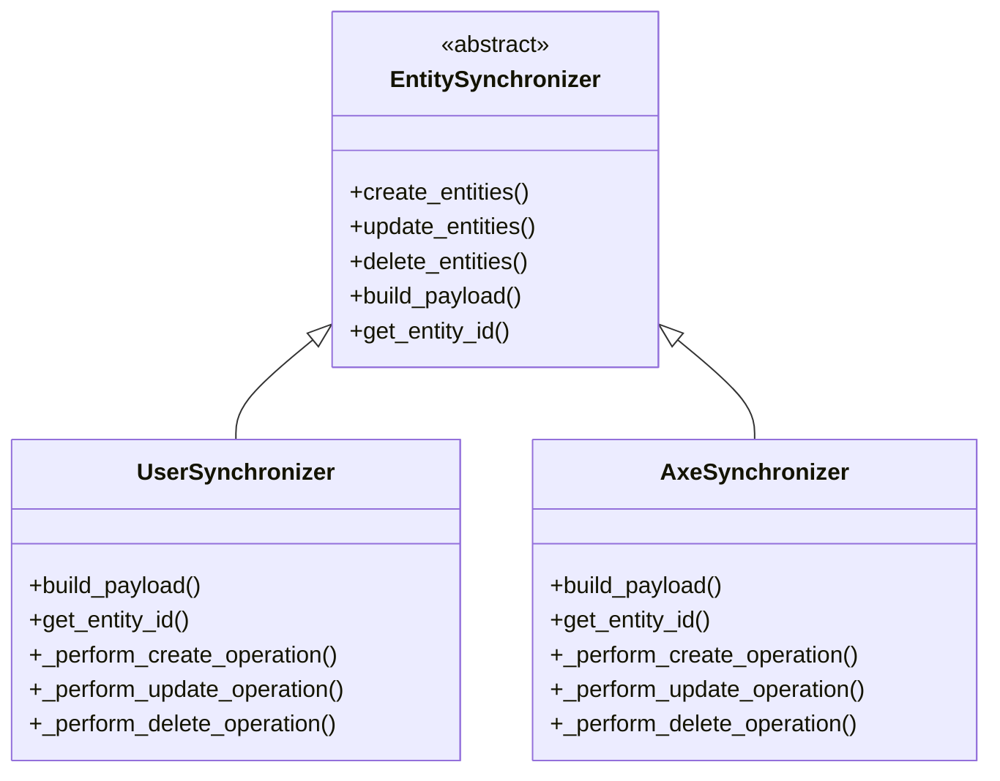
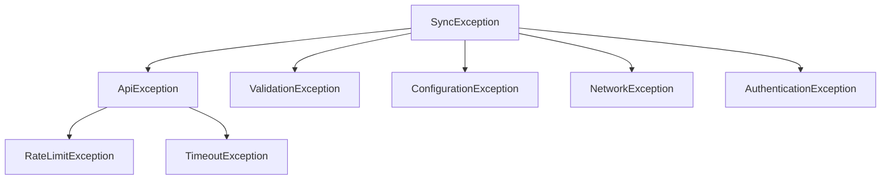

# Documentation de la Logique Metier - Synchronisation N2F

## Vue d'ensemble

Ce document decrit la logique metier derriere le script de synchronisation entre le
systeme Agresso et la plateforme N2F. Il s'agit d'un processus de synchronisation
unidirectionnelle qui transfere les donnees d'Agresso vers N2F.

## Architecture generale



## Sources de donnees

### 1. Base de donnees Agresso

**Type :** Base de donnees SQL Server (AgrProd) **Connexion :** Via variables
d'environnement

- `AGRESSO_DB_USER` : Nom d'utilisateur
- `AGRESSO_DB_PASSWORD` : Mot de passe

**Vues principales :**

- `iris_N2F_User` : Vue des donnees utilisateurs
- `iris_N2F_Analytics` : Vue des donnees analytiques (projets, axes, etc.)

### 2. Fichiers SQL de requetes

**Emplacement :** Dossier `sql/` **Fichiers :**

- `get-agresso-n2f-users.dev.sql` : Requete utilisateurs (developpement)
- `get-agresso-n2f-users.prod.sql` : Requete utilisateurs (production)
- `get-agresso-n2f-customaxes.dev.sql` : Requete axes personnalises (developpement)
- `get-agresso-n2f-customaxes.prod.sql` : Requete axes personnalises (production)

**Exemple de requete utilisateurs :**

```sql
SELECT AdresseEmail, Prenom, Nom, Entreprise, Fonction, Role, Profil, Manager
FROM iris_N2F_User
WHERE LOWER(AdresseEmail) IN ('user1@iris.be', 'user2@iris.be')
ORDER BY AdresseEmail ASC
```

**Exemple de requete axes :**

```sql
SELECT [typ], [client], [code], [description], [status], [date_from], [date_to]
FROM [AgrProd].[dbo].[iris_N2F_Analytics]
WHERE [typ] IN ('PROJECT', 'SUBPOST', 'PLAQUE')
```

### 3. Configuration YAML

**Fichiers :**

- `dev.yaml` : Configuration developpement
- `prod.yaml` : Configuration production

**Sections principales :**

```yaml
agresso:
  prod: false
  sql-path: "sql"
  sql-filename-users: "get-agresso-n2f-users.dev.sql"
  sql-filename-customaxes: "get-agresso-n2f-customaxes.dev.sql"

n2f:
  base_urls: "https://sandbox.n2f.com/services/api/v2/"
  simulate: false
  sandbox: true
```

## Cibles de donnees

### 1. API N2F

**Type :** API REST avec authentification OAuth2 **Base URLs :**

- **Sandbox (developpement) :** `https://sandbox.n2f.com/services/api/v2/`
- **Production :** `https://www.n2f.com/services/api/v2/`

**Authentification :** Client ID + Client Secret

**Endpoints principaux :**

- `/users` : Gestion des utilisateurs
- `/companies` : Gestion des entreprises
- `/customaxes` : Gestion des axes personnalises
- `/projects` : Gestion des projets

### 2. Entites synchronisees

**Utilisateurs :**

- Creation de comptes utilisateurs
- Mise a jour des profils
- Gestion des roles et permissions

**Projets :**

- Creation de projets
- Mise a jour des informations projet
- Gestion des axes de projet

**Axes personnalises :**

- Plaques (PLAQUE)
- Sous-posts (SUBPOST)
- Codes projet (PROJECT)

## Limitations et contraintes

### 1. Contraintes de l'API N2F

**Sequentialite obligatoire :**

- **Pas de parallelisation** : Les appels API doivent etre sequentiels
- **Pas de batch processing** : Un seul upsert a la fois
- **Pas de streaming** : Traitement obligatoire en memoire

**Quotas et rate limits :**

**Limites de pagination :**

- Limite de 200 elements par page pour la pagination
- Gestion automatique de la pagination avec `start` et `limit`

**Quotas d'appels API (par minute) :**

- **Jour (6h-20h) :**
  - GET : 60 appels/minute
  - WRITE (POST/PUT/DELETE) : 10 appels/minute
- **Nuit (20h-6h) :**
  - GET : 200 appels/minute
  - WRITE (POST/PUT/DELETE) : 50 appels/minute

**Gestion automatique :**

- Sessions rate-limited avec `requests_ratelimiter`
- Adaptation automatique selon l'heure (jour/nuit)
- Gestion automatique des tokens d'authentification
- Retry automatique en cas de dépassement de quota

### 2. Contraintes de la base Agresso

**Environnement de developpement :**

- Limitation a 10 elements par categorie d'axe
- Filtrage des utilisateurs par liste blanche
- Requetes optimisees pour les tests

**Environnement de production :**

- Acces complet aux donnees
- Pas de limitation sur le nombre d'elements
- Requetes optimisees pour les performances

### 3. Differences entre environnements

**Sandbox vs Production :**

- **URLs differentes :** Sandbox et production utilisent des endpoints separes
- **Quotas identiques :** Les quotas d'appels API sont les memes dans les deux
  environnements
- **Donnees :** Sandbox utilise des donnees de test, production utilise les vraies
  donnees
- **Simulation :** Mode simulation disponible en sandbox pour les tests

### 4. Contraintes techniques

**Memoire :**

- Gestion automatique de la memoire avec liberation apres chaque scope
- Limite configurable (1GB par defaut)
- Nettoyage LRU des DataFrames

**Cache :**

- TTL par defaut : 1 heure
- Taille maximale : 100 MB
- Persistance sur disque optionnelle

## Workflow de synchronisation



## Scopes de synchronisation

### 1. Scope "users"

**Fonction :** `synchronize_users` **Fichier SQL :** `get-agresso-n2f-users.*.sql`
**Entite type :** `user` **Description :** Synchronisation des utilisateurs Agresso vers
N2F

**Champs synchronises :**

- Informations personnelles (nom, prenom, email)
- Role et profil
- Entreprise et fonction
- Parametres de vehicule
- Droits et permissions

### 2. Scope "projects"

**Fonction :** `synchronize_projects` **Fichier SQL :**
`get-agresso-n2f-customaxes.*.sql` **Entite type :** `project` **Filtre SQL :**
`projects` **Description :** Synchronisation des projets (axes personnalises)

### 3. Scope "plates"

**Fonction :** `synchronize_plates` **Fichier SQL :** `get-agresso-n2f-customaxes.*.sql`
**Entite type :** `plate` **Filtre SQL :** `plates` **Description :** Synchronisation
des plaques

### 4. Scope "subposts"

**Fonction :** `synchronize_subposts` **Fichier SQL :**
`get-agresso-n2f-customaxes.*.sql` **Entite type :** `subpost` **Filtre SQL :**
`subposts` **Description :** Synchronisation des sous-posts

## Orchestration et execution

### 1. Orchestrator principal

**Classe :** `SyncOrchestrator` **Responsabilites :**

- Coordination de tous les composants
- Gestion du cycle de vie des scopes
- Collecte des metriques et rapports
- Gestion des erreurs globales

### 2. Synchronizers

**Classe abstraite :** `EntitySynchronizer` **Implementations :**

- `UserSynchronizer` : Synchronisation utilisateurs
- `AxeSynchronizer` : Synchronisation axes/projets

**Pattern CRUD :**



### 3. Gestion des erreurs

**Hierarchie d'exceptions :**



**Strategies de retry :**

- Retry automatique avec backoff exponentiel
- Gestion des timeouts reseau
- Gestion des erreurs d'authentification

## Metriques et monitoring

### 1. Metriques collectees

**Performance :**

- Duree d'execution par scope
- Nombre d'operations CRUD
- Taux de succes/echec

**Ressources :**

- Utilisation memoire
- Hit/miss ratio du cache
- Nombre d'appels API

**Operationnel :**

- Erreurs par type
- Tentatives de retry
- Temps de reponse API

### 2. Export des metriques

**Format :** JSON **Fichier :** `metrics_YYYYMMDD_HHMMSS.json` **Contenu :**

```json
{
  "execution_summary": {
    "total_duration": 120.5,
    "scopes_executed": ["users", "projects"],
    "total_operations": 150,
    "success_rate": 0.98
  },
  "scope_metrics": {
    "users": {
      "duration": 45.2,
      "operations": {
        "create": 10,
        "update": 25,
        "delete": 0
      }
    }
  }
}
```

## Utilisation et deploiement

### 1. Ligne de commande

**Exemples d'utilisation :**

```bash
# Synchronisation complete
python sync_agresso_n2f.py --scope all

# Synchronisation utilisateurs uniquement
python sync_agresso_n2f.py --scope users --create --update

# Synchronisation avec nettoyage du cache
python sync_agresso_n2f.py --scope projects --clear-cache

# Configuration production
python sync_agresso_n2f.py --config prod --scope all
```

**Options disponibles :**

- `--create` : Creer les nouvelles entites
- `--update` : Mettre a jour les entites existantes
- `--delete` : Supprimer les entites obsoletes
- `--scope` : Selectionner les scopes a traiter
- `--config` : Choisir le fichier de configuration
- `--clear-cache` : Vider le cache avant synchronisation

### 2. Variables d'environnement

**Obligatoires :**

```bash
AGRESSO_DB_USER=username
AGRESSO_DB_PASSWORD=password
N2F_CLIENT_ID=client_id
N2F_CLIENT_SECRET=client_secret
```

**Optionnelles :**

```bash
# URL de l'API N2F (par defaut selon l'environnement)
N2F_BASE_URL=https://sandbox.n2f.com/services/api/v2/  # Sandbox
# N2F_BASE_URL=https://www.n2f.com/services/api/v2/     # Production

# Mode sandbox (true pour sandbox, false pour production)
N2F_SANDBOX=true
```

## Migration vers un autre environnement

### 1. Composants a adapter

**Sources de donnees :**

- Modifier les requetes SQL dans le dossier `sql/`
- Adapter la configuration de connexion Agresso
- Mettre a jour les variables d'environnement

**Cibles de donnees :**

- Modifier l'URL de l'API N2F
- Adapter les credentials d'authentification
- Verifier la compatibilite des endpoints

**Configuration :**

- Creer de nouveaux fichiers YAML de configuration
- Adapter les parametres de cache et memoire
- Configurer les scopes specifiques a l'environnement

### 2. Points d'attention

**Compatibilite API :**

- Verifier la version de l'API N2F
- Tester les endpoints et formats de donnees
- Valider les limitations et quotas

**Performance :**

- Adapter les limites de memoire selon l'environnement
- Configurer le cache selon les ressources disponibles
- Optimiser les requetes SQL pour le volume de donnees

**Securite :**

- Utiliser des credentials securises
- Configurer l'acces reseau approprie
- Implementer la rotation des tokens si necessaire

## Fichiers de reference

### 1. Code principal

- `src/sync_agresso_n2f.py` : Point d'entree principal
- `src/core/orchestrator.py` : Orchestrateur de synchronisation
- `src/core/config.py` : Gestion de la configuration

### 2. Modules Synchronizers

- `src/business/process/base_synchronizer.py` : Classe abstraite
- `src/business/process/user_synchronizer.py` : Synchronisation utilisateurs
- `src/business/process/axe_synchronizer.py` : Synchronisation axes

### 3. Clients API

- `src/n2f/client.py` : Client API N2F
- `src/agresso/database.py` : Acces base Agresso

### 4. Configuration

- `dev.yaml` : Configuration developpement
- `prod.yaml` : Configuration production
- `sql/` : Requetes SQL de recuperation des donnees

______________________________________________________________________

*Cette documentation couvre les aspects metier essentiels pour comprendre et adapter le
script de synchronisation N2F vers un autre environnement.*

### 2. Fichiers SQL de requetes

**Emplacement :** Dossier `sql/` **Fichiers :**

- `get-agresso-n2f-users.dev.sql` : Requete utilisateurs (developpement)
- `get-agresso-n2f-users.prod.sql` : Requete utilisateurs (production)
- `get-agresso-n2f-customaxes.dev.sql` : Requete axes personnalises (developpement)
- `get-agresso-n2f-customaxes.prod.sql` : Requete axes personnalises (production)

**Exemple de requete utilisateurs :**

```sql
SELECT AdresseEmail, Prenom, Nom, Entreprise, Fonction, Role, Profil, Manager
FROM iris_N2F_User
WHERE LOWER(AdresseEmail) IN ('user1@iris.be', 'user2@iris.be')
ORDER BY AdresseEmail ASC
```

**Exemple de requete axes :**

```sql
SELECT [typ], [client], [code], [description], [status], [date_from], [date_to]
FROM [AgrProd].[dbo].[iris_N2F_Analytics]
WHERE [typ] IN ('PROJECT', 'SUBPOST', 'PLAQUE')
```

### 3. Configuration YAML

**Fichiers :**

- `dev.yaml` : Configuration developpement
- `prod.yaml` : Configuration production

**Sections principales :**

```yaml
agresso:
  prod: false
  sql-path: "sql"
  sql-filename-users: "get-agresso-n2f-users.dev.sql"
  sql-filename-customaxes: "get-agresso-n2f-customaxes.dev.sql"

n2f:
  base_urls: "https://sandbox.n2f.com/services/api/v2/"
  simulate: false
  sandbox: true
```

## Cibles de donnees

### 1. API N2F

**Type :** API REST avec authentification OAuth2 **Base URLs :**

- **Sandbox (developpement) :** `https://sandbox.n2f.com/services/api/v2/`
- **Production :** `https://www.n2f.com/services/api/v2/`

**Authentification :** Client ID + Client Secret

**Endpoints principaux :**

- `/users` : Gestion des utilisateurs
- `/companies` : Gestion des entreprises
- `/customaxes` : Gestion des axes personnalises
- `/projects` : Gestion des projets

### 2. Entites synchronisees

**Utilisateurs :**

- Creation de comptes utilisateurs
- Mise a jour des profils
- Gestion des roles et permissions

**Projets :**

- Creation de projets
- Mise a jour des informations projet
- Gestion des axes de projet

**Axes personnalises :**

- Plaques (PLAQUE)
- Sous-posts (SUBPOST)
- Codes projet (PROJECT)

## Limitations et contraintes

### 1. Contraintes de l'API N2F

**Sequentialite obligatoire :**

- **Pas de parallelisation** : Les appels API doivent etre sequentiels
- **Pas de batch processing** : Un seul upsert a la fois
- **Pas de streaming** : Traitement obligatoire en memoire

**Quotas et rate limits :**

**Limites de pagination :**

- Limite de 200 elements par page pour la pagination
- Gestion automatique de la pagination avec `start` et `limit`

**Quotas d'appels API (par minute) :**

- **Jour (6h-20h) :**
  - GET : 60 appels/minute
  - WRITE (POST/PUT/DELETE) : 10 appels/minute
- **Nuit (20h-6h) :**
  - GET : 200 appels/minute
  - WRITE (POST/PUT/DELETE) : 50 appels/minute

**Gestion automatique :**

- Sessions rate-limited avec `requests_ratelimiter`
- Adaptation automatique selon l'heure (jour/nuit)
- Gestion automatique des tokens d'authentification
- Retry automatique en cas de dépassement de quota

### 2. Contraintes de la base Agresso

**Environnement de developpement :**

- Limitation a 10 elements par categorie d'axe
- Filtrage des utilisateurs par liste blanche
- Requetes optimisees pour les tests

**Environnement de production :**

- Acces complet aux donnees
- Pas de limitation sur le nombre d'elements
- Requetes optimisees pour les performances

### 3. Differences entre environnements

**Sandbox vs Production :**

- **URLs differentes :** Sandbox et production utilisent des endpoints separes
- **Quotas identiques :** Les quotas d'appels API sont les memes dans les deux
  environnements
- **Donnees :** Sandbox utilise des donnees de test, production utilise les vraies
  donnees
- **Simulation :** Mode simulation disponible en sandbox pour les tests

### 4. Contraintes techniques

**Memoire :**

- Gestion automatique de la memoire avec liberation apres chaque scope
- Limite configurable (1GB par defaut)
- Nettoyage LRU des DataFrames

**Cache :**

- TTL par defaut : 1 heure
- Taille maximale : 100 MB
- Persistance sur disque optionnelle

## Workflow de synchronisation


## Scopes de synchronisation

### 1. Scope "users"

**Fonction :** `synchronize_users` **Fichier SQL :** `get-agresso-n2f-users.*.sql`
**Entite type :** `user` **Description :** Synchronisation des utilisateurs Agresso vers
N2F

**Champs synchronises :**

- Informations personnelles (nom, prenom, email)
- Role et profil
- Entreprise et fonction
- Parametres de vehicule
- Droits et permissions

### 2. Scope "projects"

**Fonction :** `synchronize_projects` **Fichier SQL :**
`get-agresso-n2f-customaxes.*.sql` **Entite type :** `project` **Filtre SQL :**
`projects` **Description :** Synchronisation des projets (axes personnalises)

### 3. Scope "plates"

**Fonction :** `synchronize_plates` **Fichier SQL :** `get-agresso-n2f-customaxes.*.sql`
**Entite type :** `plate` **Filtre SQL :** `plates` **Description :** Synchronisation
des plaques

### 4. Scope "subposts"

**Fonction :** `synchronize_subposts` **Fichier SQL :**
`get-agresso-n2f-customaxes.*.sql` **Entite type :** `subpost` **Filtre SQL :**
`subposts` **Description :** Synchronisation des sous-posts

## Orchestration et execution

### 1. Orchestrator principal

**Classe :** `SyncOrchestrator` **Responsabilites :**

- Coordination de tous les composants
- Gestion du cycle de vie des scopes
- Collecte des metriques et rapports
- Gestion des erreurs globales

### 2. Synchronizers

**Classe abstraite :** `EntitySynchronizer` **Implementations :**

- `UserSynchronizer` : Synchronisation utilisateurs
- `AxeSynchronizer` : Synchronisation axes/projets

**Pattern CRUD :**


### 3. Gestion des erreurs

**Hierarchie d'exceptions :**


**Strategies de retry :**

- Retry automatique avec backoff exponentiel
- Gestion des timeouts reseau
- Gestion des erreurs d'authentification

## Metriques et monitoring

### 1. Metriques collectees

**Performance :**

- Duree d'execution par scope
- Nombre d'operations CRUD
- Taux de succes/echec

**Ressources :**

- Utilisation memoire
- Hit/miss ratio du cache
- Nombre d'appels API

**Operationnel :**

- Erreurs par type
- Tentatives de retry
- Temps de reponse API

### 2. Export des metriques

**Format :** JSON **Fichier :** `metrics_YYYYMMDD_HHMMSS.json` **Contenu :**

```json
{
  "execution_summary": {
    "total_duration": 120.5,
    "scopes_executed": ["users", "projects"],
    "total_operations": 150,
    "success_rate": 0.98
  },
  "scope_metrics": {
    "users": {
      "duration": 45.2,
      "operations": {
        "create": 10,
        "update": 25,
        "delete": 0
      }
    }
  }
}
```

## Utilisation et deploiement

### 1. Ligne de commande

**Exemples d'utilisation :**

```bash
# Synchronisation complete
python sync_agresso_n2f.py --scope all

# Synchronisation utilisateurs uniquement
python sync_agresso_n2f.py --scope users --create --update

# Synchronisation avec nettoyage du cache
python sync_agresso_n2f.py --scope projects --clear-cache

# Configuration production
python sync_agresso_n2f.py --config prod --scope all
```

**Options disponibles :**

- `--create` : Creer les nouvelles entites
- `--update` : Mettre a jour les entites existantes
- `--delete` : Supprimer les entites obsoletes
- `--scope` : Selectionner les scopes a traiter
- `--config` : Choisir le fichier de configuration
- `--clear-cache` : Vider le cache avant synchronisation

### 2. Variables d'environnement

**Obligatoires :**

```bash
AGRESSO_DB_USER=username
AGRESSO_DB_PASSWORD=password
N2F_CLIENT_ID=client_id
N2F_CLIENT_SECRET=client_secret
```

**Optionnelles :**

```bash
# URL de l'API N2F (par defaut selon l'environnement)
N2F_BASE_URL=https://sandbox.n2f.com/services/api/v2/  # Sandbox
# N2F_BASE_URL=https://www.n2f.com/services/api/v2/     # Production

# Mode sandbox (true pour sandbox, false pour production)
N2F_SANDBOX=true
```

## Migration vers un autre environnement

### 1. Composants a adapter

**Sources de donnees :**

- Modifier les requetes SQL dans le dossier `sql/`
- Adapter la configuration de connexion Agresso
- Mettre a jour les variables d'environnement

**Cibles de donnees :**

- Modifier l'URL de l'API N2F
- Adapter les credentials d'authentification
- Verifier la compatibilite des endpoints

**Configuration :**

- Creer de nouveaux fichiers YAML de configuration
- Adapter les parametres de cache et memoire
- Configurer les scopes specifiques a l'environnement

### 2. Points d'attention

**Compatibilite API :**

- Verifier la version de l'API N2F
- Tester les endpoints et formats de donnees
- Valider les limitations et quotas

**Performance :**

- Adapter les limites de memoire selon l'environnement
- Configurer le cache selon les ressources disponibles
- Optimiser les requetes SQL pour le volume de donnees

**Securite :**

- Utiliser des credentials securises
- Configurer l'acces reseau approprie
- Implementer la rotation des tokens si necessaire

## Fichiers de reference

### 1. Code principal

- `src/sync_agresso_n2f.py` : Point d'entree principal
- `src/core/orchestrator.py` : Orchestrateur de synchronisation
- `src/core/config.py` : Gestion de la configuration

### 2. Modules Synchronizers

- `src/business/process/base_synchronizer.py` : Classe abstraite
- `src/business/process/user_synchronizer.py` : Synchronisation utilisateurs
- `src/business/process/axe_synchronizer.py` : Synchronisation axes

### 3. Clients API

- `src/n2f/client.py` : Client API N2F
- `src/agresso/database.py` : Acces base Agresso

### 4. Configuration

- `dev.yaml` : Configuration developpement
- `prod.yaml` : Configuration production
- `sql/` : Requetes SQL de recuperation des donnees

______________________________________________________________________

*Cette documentation couvre les aspects metier essentiels pour comprendre et adapter le
script de synchronisation N2F vers un autre environnement.*
